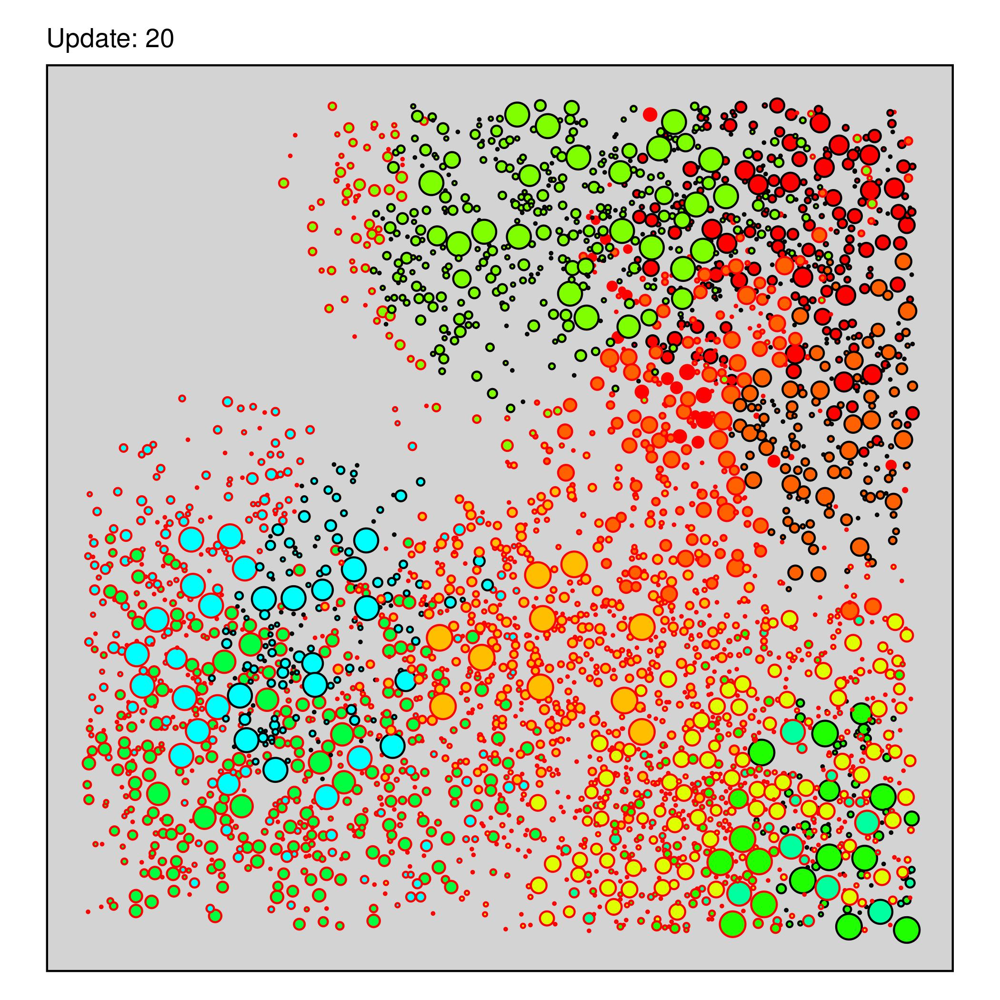

# Janzen-Connell Model

*See* `project.md` *for more information.*



## Background

The Janzen-Connell Effect explains how density-dependent mortality helps to
explain high plant diversity levels, especially in tropical rain forests. It 
postulates that high pathogen (or herbivore) pressure will lead to high seedling 
mortality in the vicinity of the mother plant, assuming that most pathogens are 
host-specific. Therefore, there will be a strong selection pressure for 
longer-range seed dispersal to ensure low population densities for each species. 
This prevents any one species from becoming dominant and thus enables stable high 
diversity levels.

## Model description

The JCM is a simple forest community model, simulating 16 tree species in a 1 km²
patch. It includes basic life-history processes and an epidemiological submodel.

*Note: there are two implementations of this model. The first uses plain Julia code
and is located in the `original` directory. The second uses the Agents.jl library
and is in the `agentsjl` directory. This file describes the original version.*

### Entities

- **Species:** A class storing the life-history traits of one tree species.
  Fields: `id`, `max_age`, `max_size`, `growth_rate`, `seed_production`,
  `dispersal_distance`, `pathogen_resistance`
  
- **Tree:** A class representing individual trees. Fields: `uid`, `species`,
  `age`, `size`, `mature`, `infection`, `position`
  
- **Pathogen:** A class representing host-specific pathogens. Fields:
  `host`, `infectious`, `infection_rate`, `infection_radius`, `lethality`

### Processes

- **Dispersal:** Mature trees produce seeds that are randomly distributed 
within the trees' dispersal distance.

- **Competition:** Each tree is checked for overlap with neighbouring trees. 
If two trees overlap, the smaller one is killed.

- **Infection:** Infected trees pass on their pathogen to conspecifics in the
neighbourhood, after an incubation period of one update. The probability 
of a successful infection depends on the distance to the infectious tree, 
the pathogen's infection rate and the recipient tree's resistance. 
Infected trees have an added per-update mortality probability given 
by the pathogens lethality.

- **Growth:** Trees increase in size until they reach their species' maximum 
size. Individuals that reach their species' maximum age die.

### Scenarios

1. **Null model**: Species have identical trait values (functional equivalence).
   No pathogens.
   
2. **Control**: Species are variable, no pathogens.

3. **Low transmission**: Species are variable, pathogens have a small infection 
  radius.

4. **High transmission**: Species are variable, pathogens have a large infection 
  radius.

## Usage

Running the model requires [Julia 1.3+](https://julialang.org/downloads/) with the
[ArgParse](https://argparsejl.readthedocs.io/en/latest/argparse.html#) package.

```
usage: jcm.jl [-s SPECIES] [-w WORLDSIZE] [-t RUNTIME] [-f DATAFILE]
              [-d DATAFREQ] [-p] [-i TRANSMISSION] [-n] [-v VERBOSITY]
              [-r SEED] [--version] [-h]

Investigate the Janzen-Connell effect in a forest model.

optional arguments:
  -s, --species SPECIES
                        the number of tree species to simulate (type:
                        Int64, default: 16)
  -w, --worldsize WORLDSIZE
                        the extent from the center of the square world
                        arena in meters (type: Int64, default: 500)
  -t, --runtime RUNTIME
                        the number of updates the simulation will run
                        (type: Int64, default: 500)
  -f, --datafile DATAFILE
                        the file to which simulation data is written
                        (default: "jcm_data.csv")
  -d, --datafreq DATAFREQ
                        the frequency in updates with which data is
                        recorded (type: Int64, default: 10)
  -p, --pathogens       run a simulation with pathogens
  -i, --transmission TRANSMISSION
                        maximum pathogen infection radius (type:
                        Int64, default: 50)
  -n, --neutral         all species have identical trait values
  -v, --verbosity VERBOSITY
                        set the log level (Debug, Info, Warn, Error)
                        (default: "Info")
  -r, --seed SEED       set the seed for the RNG (0 -> random seed)
                        (type: Int64, default: 0)
  --version             show version information and exit
  -h, --help            show this help message and exit

JCM 1.0, (c) 2020 Daniel Vedder
Ecosystem Modelling Group, University of Würzburg
```

The visualisation script `analyse.R` requires R with the packages `ggplot2`, 
`ggforce`, and `reshape2`.

## Source files

- `jcm.jl` The main module file. Import this to run the model.

- `trees.jl` Contains all classes and their default values.

- `forest.jl` Contains all process functions.

- `experiment.py` Set up and run the experiment.

- `analyse.R` Visualise model output.

## Key References

1. Comita, L. S., Queenborough, S. A., Murphy, S. J., Eck, J. L., Xu, K., 
Krishnadas, M., Beckman, N., & Zhu, Y. (2014). Testing predictions of the 
Janzen–Connell hypothesis: A meta-analysis of experimental evidence for 
distance- and density-dependent seed and seedling survival. Journal of Ecology, 
102(4), 845–856. https://doi.org/10.1111/1365-2745.12232

2. Nathan, R., & Casagrandi, R. (2004). A simple mechanistic model of seed 
dispersal, predation and plant establishment: Janzen-Connell and beyond. 
Journal of Ecology, 92(5), 733–746. https://doi.org/10.1111/j.0022-0477.2004.00914.x

3. Connell, J. H. (1971). On the role of natural enemies in preventing 
competitive exclusion in some marine animals and in rain forest trees. 
In P. J. den Boer & G. R. Gradwell (Eds.), Dynamics of Population 
(pp. 298–312). Pudoc. https://doi.org/10.1111/j.0022-0477.2004.00914.x

4. Janzen, D. H. (1970). Herbivores and the Number of Tree Species in 
Tropical Forests. The American Naturalist, 104(940), 501–528. 
https://doi.org/10.1086/282687

---
&copy; 2020-2024 Daniel Vedder

*Licensed under the terms of the MIT license.*
